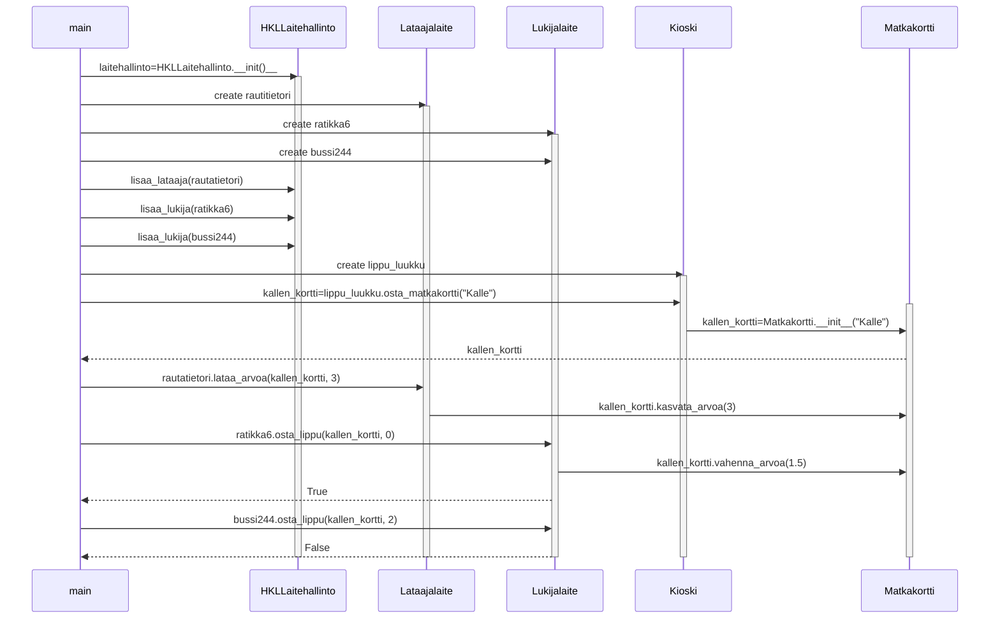

```mermaid
sequenceDiagram
    participant main
    participant HKLLaitehallinto
    participant Lataajalaite
    participant Lukijalaite
    participant Kioski
    participant Matkakortti

    


    main->>HKLLaitehallinto: laitehallinto=HKLLaitehallinto.__init()__
    activate HKLLaitehallinto
    main->>Lataajalaite: create rautitietori
    activate Lataajalaite
    main->>Lukijalaite: create ratikka6
    activate Lukijalaite
    main->>Lukijalaite: create bussi244
    main->>HKLLaitehallinto: lisaa_lataaja(rautatietori)
    main->>HKLLaitehallinto: lisaa_lukija(ratikka6)
    main->>HKLLaitehallinto: lisaa_lukija(bussi244)
    main->>Kioski: create lippu_luukku
    activate Kioski
    main->>Kioski: kallen_kortti=lippu_luukku.osta_matkakortti("Kalle")
    activate Matkakortti
    Kioski->>Matkakortti: kallen_kortti=Matkakortti.__init__("Kalle")
    Matkakortti-->>main: kallen_kortti
    main->>Lataajalaite: rautatietori.lataa_arvoa(kallen_kortti, 3)
    Lataajalaite->>Matkakortti: kallen_kortti.kasvata_arvoa(3)
    main->>Lukijalaite: ratikka6.osta_lippu(kallen_kortti, 0)
    Lukijalaite->>Matkakortti: kallen_kortti.vahenna_arvoa(1.5)
    Lukijalaite-->>main: True
    main->>Lukijalaite: bussi244.osta_lippu(kallen_kortti, 2)
    Lukijalaite-->>main: False


    deactivate HKLLaitehallinto
    deactivate Lataajalaite
    deactivate Lukijalaite
    deactivate Kioski
    deactivate Matkakortti


```

