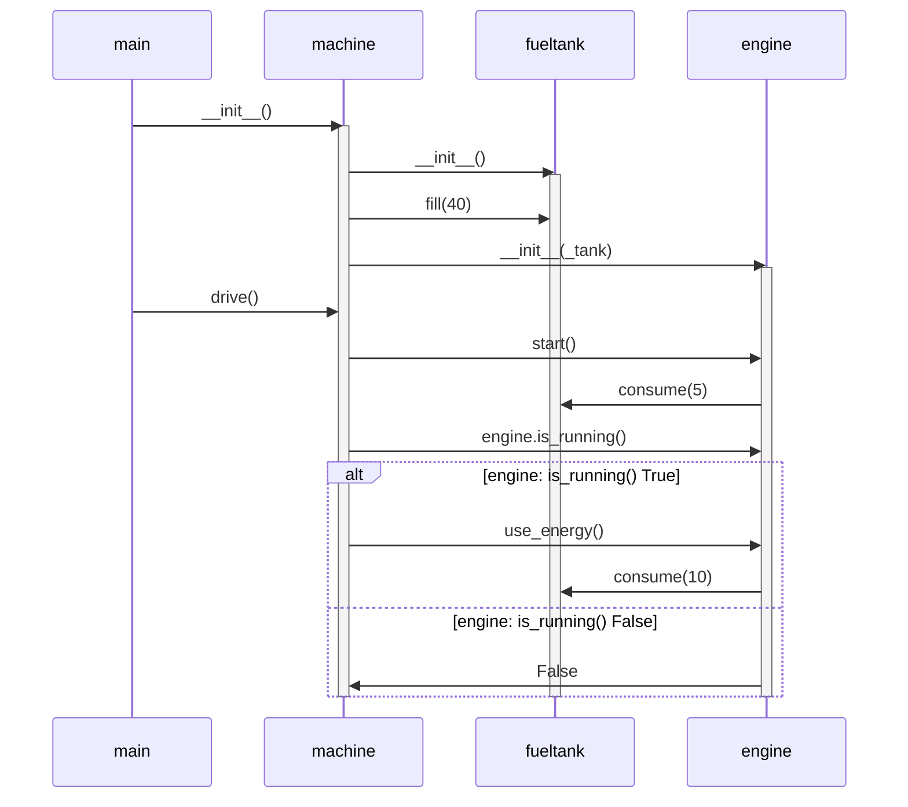

```mermaid
sequenceDiagram
    participant main
    participant machine
    participant fueltank
    participant engine


    main->>machine: __init__()
    activate machine
    machine->>fueltank: __init__()
    activate fueltank
    machine->>fueltank: fill(40)
    machine->>engine: __init__(_tank)
    activate engine
    main->>machine: drive()
    machine->>engine: start()
    engine->>fueltank: consume(5)
    machine->>engine: engine.is_running()
    alt engine: is_running() True
        machine->>engine: use_energy()
        engine->>fueltank: consume(10)
    else engine: is_running() False
        engine->>machine: False
    end


    deactivate machine
    deactivate fueltank
    deactivate engine

```

