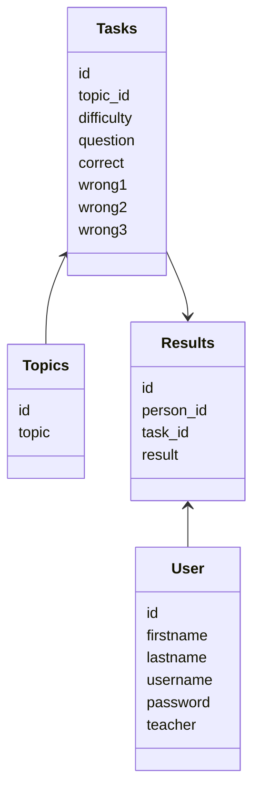

# Arkkitehtuurikuvaus

## Rakenne

## Käyttöliittymä

## Sovelluslogiikka

## Tietojen pysyväistallennus
Tiedot tallennetaan sqlite3 tietokantaan. 

Luokkien:
- User
- Task
- Topics
- Result

data tallennetaan kaikki SQL tietokantaan. Tietokannan taulut ja kentät kuvattu alla. Tarkemmin [schema.sql](https://github.com/miahro/ot-harjoitustyo/blob/master/schooltasks/dokumentaatio/schema.sql) 

## Päätoiminnallisuudet

### Käyttäjän kirjautuminen

### Uuden käyttäjän luominen

### Tehvävien tekeminen

### Tulosten tarkastelu 

### Opettajan toiminnallisuudet 