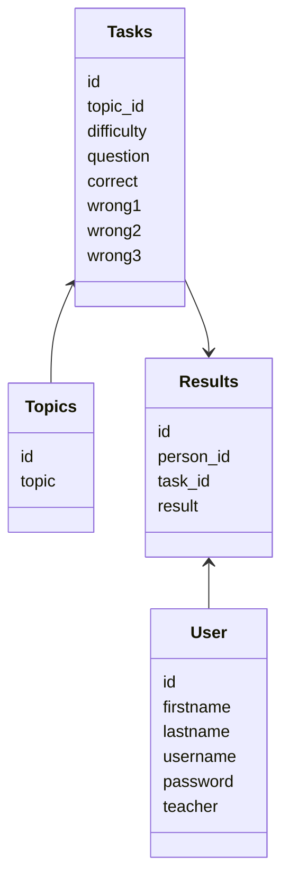
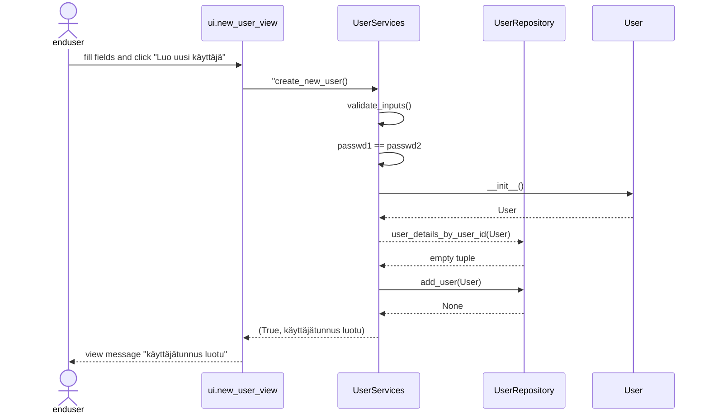

# Arkkitehtuurikuvaus

## Rakenne

## Käyttöliittymä

## Sovelluslogiikka

## Tietojen pysyväistallennus
Tiedot tallennetaan sqlite3 tietokantaan. 

Luokkien:
- User
- Task
- Topics
- Result

data tallennetaan kaikki SQL tietokantaan. Tietokannan taulut ja kentät kuvattu alla. Tarkemmin [schema.sql](https://github.com/miahro/ot-harjoitustyo/blob/master/schooltasks/dokumentaatio/schema.sql) 

## Päätoiminnallisuudet

### Käyttäjän kirjautuminen

### Uuden käyttäjän luominen
Uuden käyttäjän luontinäkymässä käyttäjä syöttää tiedot kenttiin:
- etunimi
- sukunimi
- käyttätunnus
- salasana
- salasana uudestaan

ja painaa "Luo uusi käyttäjä" painiketta. 

Kenttien syötteelle on seuraavat kriteerit:
- mikään kenttä ei saa olla tyhjä
- samaa käyttäjätunnusta ei ole olemassa
- salasana ja salasana uudelleen ovat samat

Alla on kuvattu sekvenssikaavio onnistuneelle uuden käyttäjän luonnille:

Käyttäjän täytettyä tiedot ja klikattua "Luo uusi käyttäjä", ui.new_user_view kutsuu UserServices create_new_user metodia. Metodia tarkastaa ensin, ettei syötteessä ole tyhjiä kenttiä, ja sitten että salasanat ovat samoja. Jomman kumman tarkistuksen epäonnistuminen palauttausi ui.new_user_view:n virheviestin. Tämän jälkeen UserServices luo User-olion. Seuraavaksi UserServices kutsuu UserRepositoryn user_details_by_user_id metodia sen tarkistamiseksi, ettei käyttäjätunnusta ole jo olemassa. Jos on, palautetaan virheviesti ui.new_user_view:lle. Mikäli käyttätätunnusta ei ole olemassa, UserServices kutsuu UserRepositoryn metodia add_user, ja palauttaa "käyttäjätunnus luotu"-viestin ui.new_user_view-näkymälle. ui.new_user_view näyttää viestin käyttäjälle. 

### Tehtävien tekeminen

### Tulosten tarkastelu 

