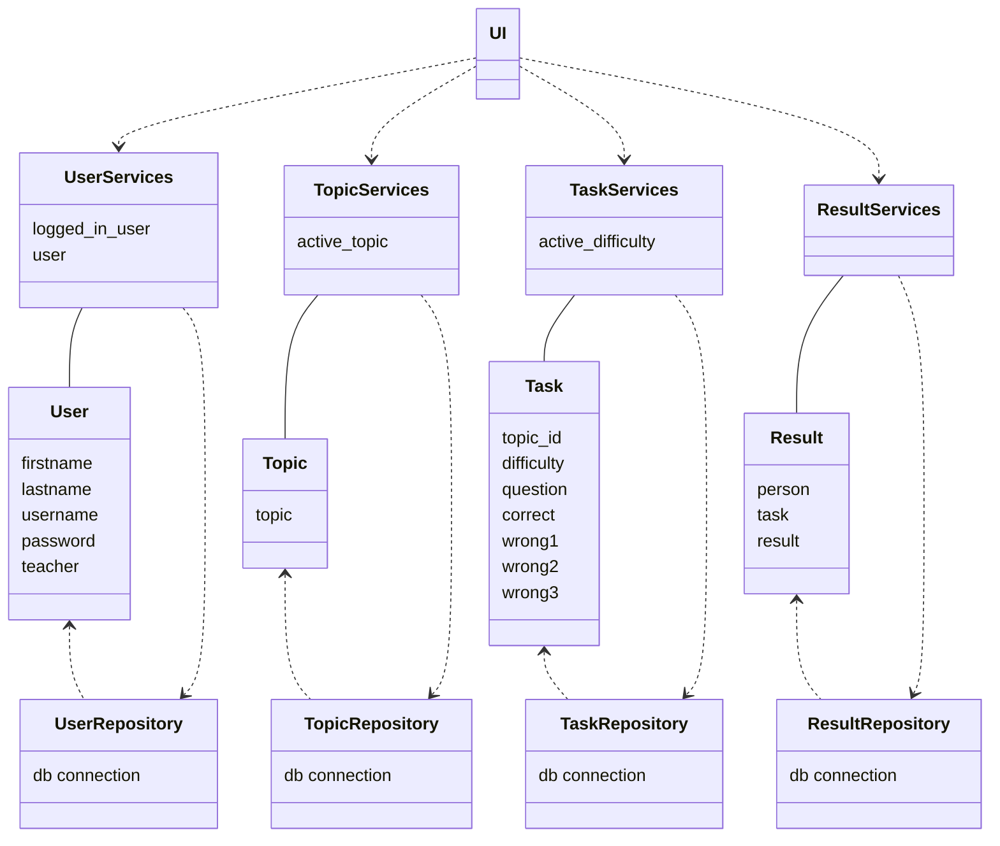
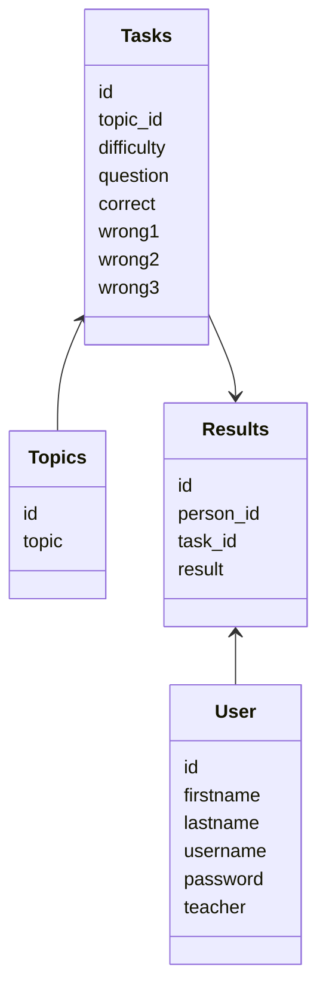
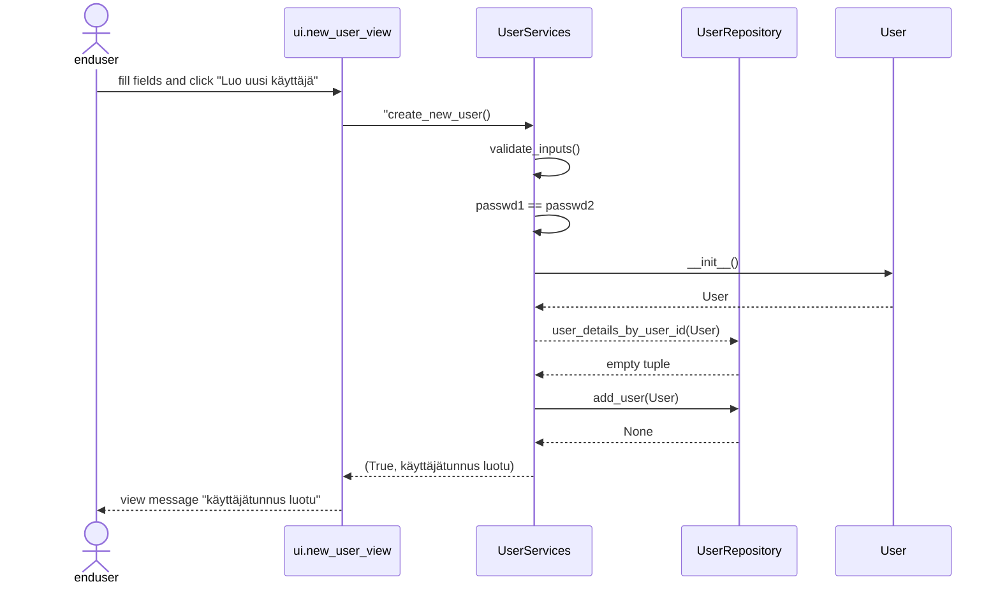

# Arkkitehtuurikuvaus

## Rakenne

Koodin pakkausrakenne alla:

Pakkausten sisältö on seuraava:
- ui sisältää käyttöliittymästä vastaavan koodin
- services sisältää sovelluslogiikasta vastaavat luokat
- repositories sisältää luokat, jotka vastaavat tietojen pysyväistallennuksesta sekä tietokantakyselyistä
- entities sisältää sovelluksen käyttämät tieto-luokat

## Käyttöliittymä

Käyttöliittymä sisältää näkymät:
- aloitusnäkymä, jossa valitaan joko uuden käyttäjän luominen tai sisäänkirjautuminen
- uusi käyttäjä näkymä, jossa luodaan uusi käyttäjä
- kirjautumisnäkymä, jossa käyttäjä kirjautuu sisään
- valintanäkymä, jossa valitaan joko tulosten tarkastelu tai aihe sekä vaikeustaso ja jatketaan tehtävänäkymään
- tehtävänäkymässä tehdään tehtäviä
- tulosnäkymässä käyttäjä näkee yhteenvedon tuloksistaan

Jokainen näkymä on toteutettu oman luokkanaan. Käyttöliittymä on eriytetty muuten täysin sovelluslokiigasta, paitsi poikkeuksena tulosnäkymä pitää kirjaa kierroksen tehtävistä (tämä ei ole pysyväistalletettava tieto vaan vain tehtäväkierroksen väliaikainen tieto)

## Sovelluslogiikka

Sovelluksen tietomallin muodostavat luokat:
- User, joka kuvaa käyttäjän ominaisuuksia
- Topic, joka kuvaa tehtävän aiheen ominaisuuksia
- Task, joka kuvaa tehtävän ominaisuuksia
- Result, joka kuvaa tuloksen ominaisuuksia

Näistä tarkemmin alla, kohdassa "Tietokantamalli"

Toiminnallisista kokonaisuuksista vastaavat services-luokat:
- UserServices
- TopicServices
- TaskServices
- ResultServices

Services luokat pääsevät käsiksi tietokannan tietoihin repositories luokkien kautta. Repostitories luokkia on yksi kullekin tietoluokalla:
- UserRepository
- TopicRepository
- TaskRepository
- ResultRepository

Luokkien suhteet kuvattu alla:

## Tietojen pysyväistallennus

### Tietokantamalli
Tiedot tallennetaan sqlite3 tietokantaan. 

Luokkien:
- User
- Task
- Topics
- Result

data tallennetaan kaikki SQL tietokantaan. Tietokannan taulut ja kentät kuvattu alla. Tarkemmin [schema.sql](https://github.com/miahro/ot-harjoitustyo/blob/master/schooltasks/dokumentaatio/schema.sql) 

### Tiedostot

## Päätoiminnallisuudet

### Käyttäjän kirjautuminen
- lisätään

### Uuden käyttäjän luominen
Uuden käyttäjän luontinäkymässä käyttäjä syöttää tiedot kenttiin:
- etunimi
- sukunimi
- käyttätunnus
- salasana
- salasana uudestaan

ja painaa "Luo uusi käyttäjä" painiketta. 

Kenttien syötteelle on seuraavat kriteerit:
- mikään kenttä ei saa olla tyhjä
- samaa käyttäjätunnusta ei ole olemassa
- salasana ja salasana uudelleen ovat samat

Alla on kuvattu sekvenssikaavio onnistuneelle uuden käyttäjän luonnille:

Käyttäjän täytettyä tiedot ja klikattua "Luo uusi käyttäjä", ui.new_user_view kutsuu UserServices create_new_user metodia. Metodia tarkastaa ensin, ettei syötteessä ole tyhjiä kenttiä, ja sitten että salasanat ovat samoja. Jomman kumman tarkistuksen epäonnistuminen palauttausi ui.new_user_view:n virheviestin. Tämän jälkeen UserServices luo User-olion. Seuraavaksi UserServices kutsuu UserRepositoryn user_details_by_user_id metodia sen tarkistamiseksi, ettei käyttäjätunnusta ole jo olemassa. Jos on, palautetaan virheviesti ui.new_user_view:lle. Mikäli käyttätätunnusta ei ole olemassa, UserServices kutsuu UserRepositoryn metodia add_user, ja palauttaa "käyttäjätunnus luotu"-viestin ui.new_user_view-näkymälle. ui.new_user_view näyttää viestin käyttäjälle. 

### Tehtävien tekeminen
- lisätään

### Tulosten tarkastelu 
- lisätään
